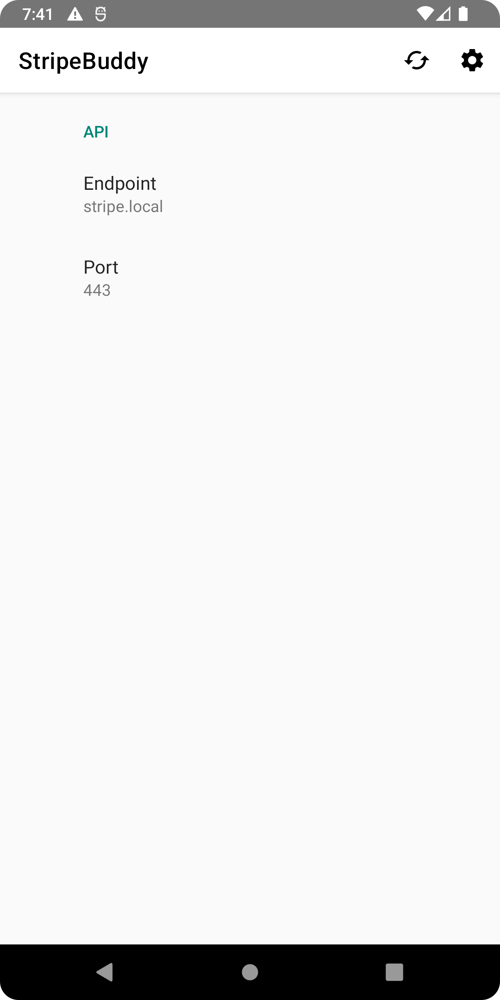

#  StripeBuddy
## Description
This app is a native Android client for the [ESP-Stripe-Server](https://github.com/procrastimax/ESP32-LED-Stripe-Server.git).
In the settings menu you can set the endpoint configuration (URL, Port) for your Stripe-Server.
With this app it is possible to control all three 8-bit color channels (RGB) of your LED stripe and also set up the overall brightness (also in 8-bit).

**Attention:** The app relies on HTTPS (no HTTP!), you therefore need to build the app on your own and I cannot provide a prebuilt APK. Read more in [Building](#building).

## Building
The easiest way to build this app on your own is to download AndroidStudio, and import the whole repository.
The reason to build the app yourself, is that normally the StripeServer relies on a self-signed SSL certificate. If you are able to run the StripeServer with an officially signed SSL certificate, you don't need to build the app on yourself.

To make the self-signed server certificate work, you'll need to import the certifcate authoritie's (CA) certificate, which you used to create the self-signed SSL certificate, into the code and build the app with this certificate.
For this follow the instructions in the [StripeServer](https://github.com/procrastimax/ESP32-LED-Stripe-Server.git) README or in the [self-signed-certificate](https://github.com/procrastimax/self-signed-ssl-certs.git) README.

After creating your needed certificates, you have to import the CA certificate to `/raw/ca.crt`. The file `xml/network_security_config.xml` specifies this certificate.

## How does it look?

